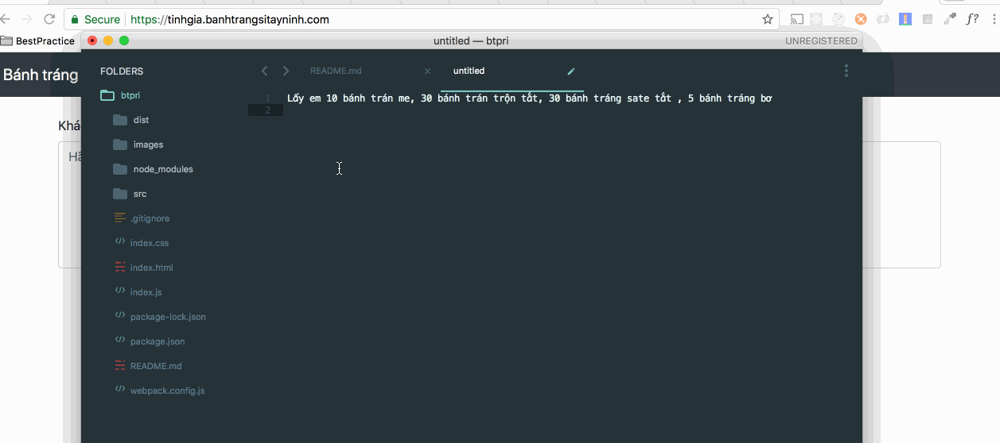

# btpri

A tool help my employees to calculate order price faster.

# Demo

Demo url: [https://tinhgia.banhtrangsitayninh.com/](https://tinhgia.banhtrangsitayninh.com/)




## Getting Started


Copy customer text and paste into the textarea. Wait for the result then copy it response to the customer.

Example:

Copy the text
```
Lấy em 10 bánh trán me, 30 bánh trán trộn tắt, 30 bánh tráng sate tắt , 5 bánh tráng bơ
```

You will get:
```
Me: 10 * 6k = 60k
Trộn tắc: 30 * 6k = 180k
Sa tế tắc: 30 * 6k = 180k
Bơ: 5 * 10k = 50k
____________________
Tổng tiền hàng: 470k
```


## Versioning

We use [SemVer](http://semver.org/) for versioning. For the versions available, see the [tags on this repository](https://github.com/darkamenosa/btpri/tags). 

## Authors

* **tuyenhx**

## License

This project is licensed under the MIT License - see the [LICENSE.md](LICENSE.md) file for details
